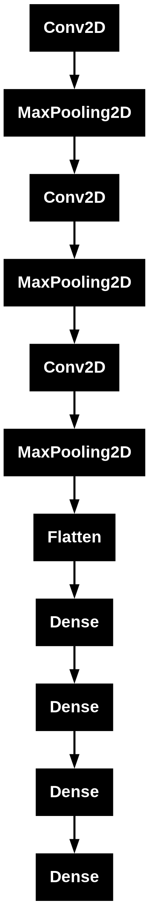

# Fruit Classification with a Neural Network
      


## Overview

This project implements a **Convolutional Neural Network (CNN)** using **TensorFlow** to classify images of apples and pears. The model accurately distinguishes between these two fruits, utilizing deep learning and image processing techniques. Potential applications include **self-checkout kiosks** and **cash registers**, where it could streamline the checkout process by eliminating the need for manually looking for a fruit's id for weighing. This solution could enhance the customer experience and employee satisfaction, optimizing retail operations.

## Business Problem

**Long lines** at checkout counters are a common **frustration** for both customers and retailers. **Customers often become stressed** and may abandon their shopping carts if the wait becomes too long, resulting in **lost sales**. For cashiers, long lines create **additional pressure**, leading to **increased stress**, **decreased efficiency**, and a higher likelihood of errors in the checkout process.

While self-checkout systems aim to alleviate some of these issues, many customers find them **confusing** or **difficult to use**, which can add to the frustration instead of solving it. If self-checkout kiosks are not intuitive or fast, they can **further delay the process** and worsen the customer experience.

**A key factor in improving checkout speed and efficiency is the ability to identify and classify produce items quickly and accurately**. In many cases, identifying fruits and vegetables for weighing or pricing requires either searching for product codes or entering information manually, which can slow down the process. **By automating and streamlining this step, retailers can significantly enhance customer experience and improve operational efficiency.**

## Methodology

The project followed a standard machine learning pipeline, including the following key steps:

### Dataset

The dataset used for this project is available at [Kaggle's Fruit and Vegetable Image Recognition dataset](https://www.kaggle.com/datasets/kritikseth/fruit-and-vegetable-image-recognition). The dataset contains labeled images of various fruits and vegetables, and for this project, we focused on classifying apples and pears.

#### Dataset Structure

```
- archive/
  - train/
    - apples/
    - pears/
  - test/
    - apples/
    - pears/
```

### Image Preprocessing

- **Image Resizing:** All images were resized to 64x64 pixels to standardize the input for the Convolutional Neural Network (CNN) model.
- **Normalization:** Pixel values were scaled to the range [0, 1] by dividing by 255 to improve model convergence.
- **Data Augmentation:** To increase variability and prevent overfitting, the training dataset was augmented using random transformations, such as rotation, flipping, and zooming.

### Model Building

The model is a **CNN** with the following architecture:

1. **Convolutional Layers**: These layers extract features from the images (e.g., edges, textures, shapes).
2. **MaxPooling Layers**: These layers reduce the spatial dimensions of the feature maps, helping to decrease computational complexity while retaining important information.
3. **Flatten Layer**: The output of the convolutional layers is flattened into a 1D vector to feed into the fully connected layers.
4. **Dense Layers**: These layers learn high-level representations and output a binary classification result (apple or pear).
5. **Output Layer**: The final layer uses a **sigmoid activation** to output a value between 0 and 1, where values closer to 0 indicate "apple" and values closer to 1 indicate "pear".



### Model Training

The model was compiled with the **Adam optimizer** and **binary cross-entropy loss**, appropriate for binary classification tasks. Training was conducted for **100 epochs** with a batch size of 20. During training, the model's performance was monitored using accuracy as the primary metric.

### Model Evaluation

Model performance was assessed using accuracy, and a confusion matrix was generated to visualize the results. Predictions were made on the test set, and the results were compared with the true labels using accuracy score and a classification report.

## Key Technologies

- **TensorFlow**: Used for model building and training the Convolutional Neural Network (CNN).
- **Keras**: Utilized for constructing the neural network architecture, including layers and activation functions.
- **OpenCV**: Employed for image preprocessing, such as resizing and augmenting the dataset.
- **Scikit-learn**: Used for model evaluation, including metrics like accuracy and classification report generation.
- **Matplotlib / Seaborn**: Used for visualizing model performance (e.g., accuracy/loss curves, confusion matrix).
- **NumPy**: Applied for handling numerical data and array manipulation.

You can install the dependencies using the following command:

```bash
pip install tensorflow numpy opencv-python matplotlib seaborn scikit-learn
```

## Results
The model achieved an accuracy of over **90%** on the test dataset, demonstrating its ability to effectively classify apples and pears. The following performance metrics were observed:
- **Precision:** 0.92 (indicating high precision in identifying both apples and pears)
- **Recall:** 0.91 (ensuring few misclassifications)
- **F1-Score:** 0.91 (balanced performance between precision and recall)

## Possible Real-World Implementation

- **Self-Checkout and Cash Registers:** The model can be seamlessly integrated into **self-checkout kiosks** and **cash registers** to automate fruit identification. With perfect classification accuracy, it eliminates the need for manual look-ups, significantly speeding up the checkout process and reducing errors.


